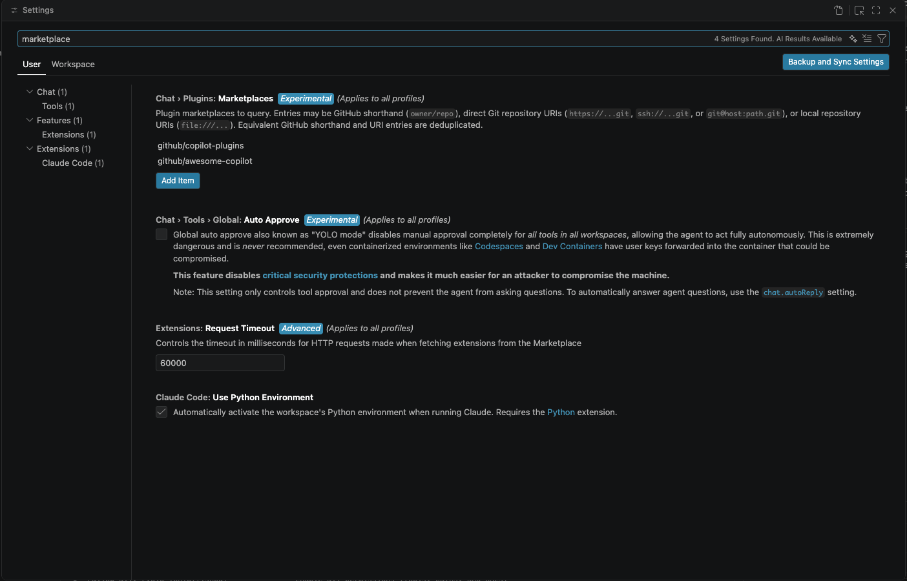
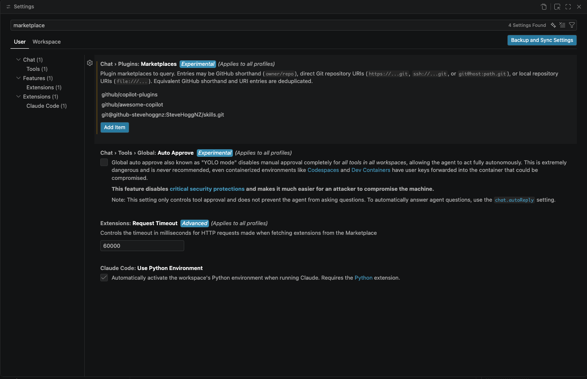
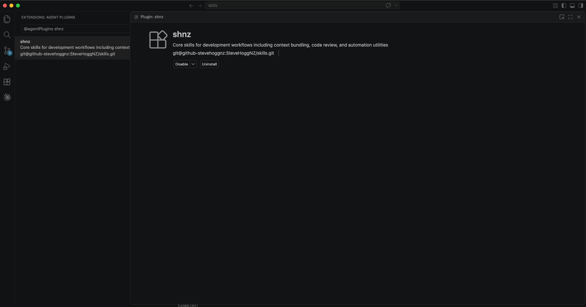

# Installing the `shnz-skills` marketplace

Choose your IDE below, then follow the appropriate install path for your use case.

## VS Code

### 1) Add the marketplace in VS Code

1. Open Settings in VS Code (`Cmd+,` on macOS).
2. Search for `agent plugin marketplace` (or `marketplace`).
3. Add your marketplace repository URL.

Example source:

`https://github.com/xyz/skills`

UI reference:



#### Private repo option (custom SSH key)

If your marketplace repository is private and uses a non-default SSH key, define a host alias in `~/.ssh/config` and use that alias in the Git URL.

```sshconfig
Host github-stevehoggnz
	HostName github.com
	User git
	IdentityFile ~/.ssh/id_ed25519_stevehoggnz_github
	IdentitiesOnly yes
	IdentityAgent none
```

Then add the marketplace using an SSH URL like:

`git@github-stevehoggnz:SteveHoggNZ/skills.git`

Private repo UI reference:



### 2) Repository structure

VS Code discovers plugins from the marketplace manifest:

- Root manifest: [marketplace.json](../marketplace.json)
- Claude-compatible marketplace manifest: [marketplace.json](../.claude-plugin/marketplace.json)
- Plugin manifest: [plugin.json](../plugins/shnz/.claude-plugin/plugin.json)
- Example skill: [SKILL.md](../plugins/shnz/skills/dump/SKILL.md)

### 3) Install a plugin

After the marketplace is registered in Settings:

Install UI reference:



1. Open the Agent/Skills plugin install UI in VS Code.
2. Select plugin `shnz` from marketplace `shnz-skills`.
3. Choose install scope:
	- User scope: available across repositories.
	- Workspace scope: available only in the current repo.

### 4) Local install folder

Installed agent plugins are stored in your home folder under:

- ~/.vscode/agent-plugins
- ~/.vscode-insiders/agent-plugins

Use the folder that matches the VS Code build you are running.

### 5) Verify installation

Confirm the `dump` skill can be discovered and invoked by your agent in this workspace.

---

## Claude Code

Two install paths, for two audiences:

- **Consumers** (you want to *use* these skills): [install via git URL](#claude-code-consumers). One command. Auto-updates at Claude Code startup.
- **Developers** (you want to *modify* these skills): [install from a local clone](#claude-code-developers). Your on-disk edits become the installed state immediately.

### Prerequisites

- A working Claude Code install that supports `/plugin marketplace add`.
- For the git-URL path, access to the repo — [SteveHoggNZ/skills](https://github.com/SteveHoggNZ/skills) is **private**, so you'll need either collaborator access with your SSH key loaded (`ssh-add`), or a `GITHUB_TOKEN` / HTTPS credential helper set up for background auto-updates.

### Claude Code Consumers

The fastest path — Claude Code clones into its managed cache so you don't need to clone manually.

#### Install

```
/plugin marketplace add SteveHoggNZ/skills
/plugin install shnz@shnz-skills
```

That's it. GitHub shorthand (`owner/repo`) is the preferred form; explicit git URLs (`https://github.com/SteveHoggNZ/skills.git` or `git@github.com:SteveHoggNZ/skills.git`) also work if you're on a non-GitHub host.

#### Pinning to a version/branch/commit

Append `@ref` to the shorthand or `#ref` to a full URL:

```
/plugin marketplace add SteveHoggNZ/skills@v1.0     # a tag
/plugin marketplace add SteveHoggNZ/skills@main     # a branch (default if omitted)
/plugin marketplace add SteveHoggNZ/skills@<sha>    # a specific commit
```

#### Updates

- **Automatic** on Claude Code startup for public repos, and for private repos where you've set the appropriate env var (`GITHUB_TOKEN`, `GITLAB_TOKEN`, etc.).
- **Manual** any time:
  ```
  /plugin marketplace update shnz-skills
  ```
  or from the CLI: `claude plugin marketplace update shnz-skills`.

#### Cache location

Claude Code stores clones under `~/.claude/plugins/marketplaces/shnz-skills/` and installed plugin versions under `~/.claude/plugins/cache/shnz-skills/shnz/<version>/`. You shouldn't need to touch these — they're managed.

### Claude Code Developers

Use this path if you're editing skills in this marketplace and want the edits to go live immediately.

#### Install from your local clone

```
git clone git@github.com:SteveHoggNZ/skills.git ~/Projects/SteveHoggNZ/skills
cd ~/Projects/SteveHoggNZ/skills
```

Then in any Claude Code session:

```
/plugin marketplace add /absolute/path/to/your/clone
/plugin install shnz@shnz-skills
```

Use whatever path you cloned to. No enforced convention — `~/Projects/` is fine.

#### Edit propagation

- **File edits** (`SKILL.md`, `core.md`, `reference/*`, examples, etc.) show up in the **next** Claude Code session with no refresh. The installed plugin IS your working tree.
- **Metadata edits** (`.claude-plugin/marketplace.json`, `plugins/shnz/.claude-plugin/plugin.json`) need `/reload-plugins` to be noticed. Relevant when:
  - You add a new skill directory.
  - You bump a plugin/marketplace version.
  - You change descriptions or triggers in plugin/marketplace metadata.

#### Adding a new skill

1. Create `plugins/shnz/skills/<name>/` with the usual files. Look at any existing skill for the pattern.
2. Commit and (optionally) push.
3. In a running Claude Code session, run `/reload-plugins` to make the new skill discoverable.

No separate registration: plugins auto-discover every `skills/*/SKILL.md` under the plugin root. `/reload-plugins` only matters because the skill list is cached.

#### Switching from developer mode to consumer mode (or vice versa)

Uninstall the current registration before installing the other path, to avoid two registrations for the same marketplace:

```
/plugin uninstall shnz@shnz-skills
/plugin marketplace remove shnz-skills
```

Then install via the other path.

---

## Uninstall

```
/plugin uninstall shnz@shnz-skills
/plugin marketplace remove shnz-skills
```

This removes the registration. If you installed via git URL, Claude Code's managed cache is cleaned up. If you installed via local path, your clone is untouched — just unregistered.

## Troubleshooting

- **"Marketplace not found"** — for local paths, check the path is absolute and points at a directory containing `.claude-plugin/marketplace.json`. For git URLs, check you have access (`git clone` from the same shell should succeed).
- **"Plugin shnz not found"** — you've registered the marketplace but haven't installed the plugin yet. Run `/plugin install shnz@shnz-skills`.
- **Edits don't show up** — start a new session, or run `/reload-plugins`. If you changed metadata, `/reload-plugins` is required even in the same session.
- **Slash commands don't appear** — confirm installation with `/plugin list`. If the plugin is present but skills aren't firing, check the skill's `SKILL.md` frontmatter (`name:` and `description:` are required and must be valid YAML).
- **Private-repo auto-update fails silently** — export `GITHUB_TOKEN` (or the equivalent for your host) in the environment Claude Code runs in. SSH agent alone is fine for interactive `/plugin marketplace update` but not for background auto-updates.

