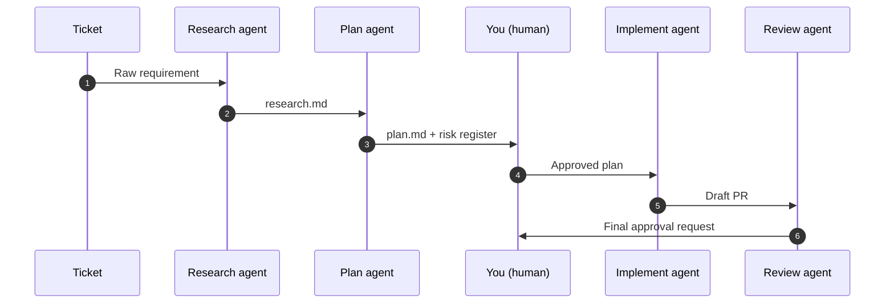
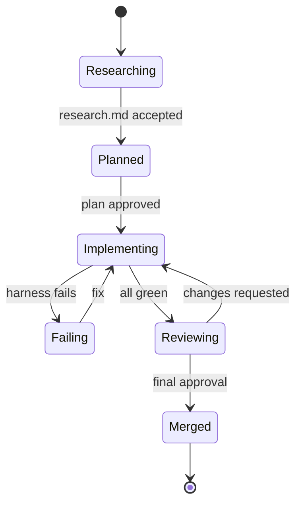

# Diagrams

A picture beats a thousand words, *when* the picture carries structural information the text cannot. Concept sites need diagrams in specific places:

- **Architectures and topologies** (the Map): "here is how the parts are arranged".
- **Sequences and flows** (the Vision's "in motion"): "here is who hands what to whom".
- **State machines** (sometimes the Vision, sometimes a deep section): "the system moves between these named states".
- **Lifecycles** (the Map, if it is phase-based): "this is the end-to-end loop".

Diagrams are not decoration. A diagram that illustrates something already clear in prose is noise.

## Three layers of diagram support

Pick the right layer for each diagram. They are not interchangeable.

| Layer | Authored as | Strengths | Weaknesses |
|---|---|---|---|
| **HTML-native components** (default) | Real DOM elements (`.stack-diagram`, `.chain`, `.hex-grid`, `.pyramid`, `.matrix-2x2`) | Inherit the site's typography and CSS vars; print perfectly; accessible (real headings / text); feel modern; slide-mode compatible. | Limited to the shapes the stylesheet supports. |
| **Mermaid** (text-as-source) | `<pre class="mermaid">` with mermaid DSL | Good at branching logic, sequences with many actors, state machines, ER. Text source is version-controllable. | Diagrams render as opaque SVGs. Less polish than bespoke DOM. Dependencies at runtime (lazy CDN). |
| **SVG drop-in** (escape hatch) | `` from Excalidraw / Figma / hand | Full control. Any shape. | Manual authoring. Not generable from intake. |

**Reach for HTML-native first.** Use mermaid when the shape has genuine branching / sequence / state logic that does not fit a component. Use SVG when nothing else fits.

## HTML-native components

Five shapes ship in the stylesheet. Each is composed of real DOM elements and inherits the site's palette via `is-*` modifier classes (`is-teal`, `is-blue`, `is-purple`, `is-orange`, `is-pink`).

Wrap each diagram in `<figure class="diagram">` with a `<figcaption>` so it sits consistently with mermaid and SVG diagrams.

### `.stack-diagram` — layered stack

For concepts where one thing *sits on top of* another. Typical uses: intent / context / prompting; control plane / data plane; platform tiers.

```html
<figure class="diagram">
  <div class="stack-diagram">
    <div class="stack-layer is-purple">
      <h4>Intent</h4>
      <p>The goal, constraints, and success criteria.</p>
    </div>
    <div class="stack-layer is-blue">
      <h4>Context</h4>
      <p>Files, research, prior decisions the agent needs.</p>
    </div>
    <div class="stack-layer is-teal">
      <h4>Prompting</h4>
      <p>The specific wording of the request.</p>
    </div>
  </div>
  <figcaption>Intent sits above context, which sits above prompting.</figcaption>
</figure>
```

Rules: 2–5 layers; first layer is the top. Layers have a `<h4>` and one short paragraph.

### `.chain` — horizontal sequence

Named phases in order, connected by arrows. Use for waves, pipelines, staged rollouts. Lighter weight than `.flow` (which has actor + action columns).

```html
<figure class="diagram">
  <div class="chain">
    <div class="chain-step is-teal"><h4>Assistance</h4><p>AI suggests; you accept.</p></div>
    <div class="chain-step is-blue"><h4>Augmentation</h4><p>AI drafts; you review.</p></div>
    <div class="chain-step is-purple"><h4>Orchestration</h4><p>Agents coordinate.</p></div>
    <div class="chain-step is-orange"><h4>Autonomy</h4><p>You set intent; agents run.</p></div>
  </div>
  <figcaption>The four waves of AI adoption.</figcaption>
</figure>
```

Rules: 3–6 steps. Each step has a `<h4>` and a one-line description.

### `.hex-grid` — hexagonal cells

For lifecycle / phase concepts. The grid is rectangular; the "loop" is implied by the sequence of cells (and optionally stated in the caption). Use when the spatial honeycomb reads as the concept's natural shape.

```html
<figure class="diagram">
  <div class="hex-grid">
    <div class="hex"><div class="hex-inner"><h4>Plan</h4><p>Intent captured</p></div></div>
    <div class="hex"><div class="hex-inner"><h4>Design</h4><p>Architecture set</p></div></div>
    <div class="hex"><div class="hex-inner"><h4>Code</h4><p>Agents implement</p></div></div>
    <div class="hex"><div class="hex-inner"><h4>Test</h4><p>Harnesses enforce</p></div></div>
    <div class="hex"><div class="hex-inner"><h4>Review</h4><p>Humans approve</p></div></div>
    <div class="hex"><div class="hex-inner"><h4>Deploy</h4><p>Release loop</p></div></div>
    <div class="hex"><div class="hex-inner"><h4>Operate</h4><p>Monitor signals</p></div></div>
    <div class="hex"><div class="hex-inner"><h4>Maintain</h4><p>Feeds back to Plan</p></div></div>
  </div>
  <figcaption>Eight phases, each feeding the next. Maintain loops back to Plan.</figcaption>
</figure>
```

Rules: labels are short (1–3 words). Use `is-*` on a single hex to mark the current or focus phase; leave others neutral.

### `.pyramid` — narrowing tiers

For maturity ladders, capability hierarchies, or "few at the top, many at the base" concepts. Up to 5 tiers. Top tier comes first in the markup.

```html
<figure class="diagram">
  <div class="pyramid">
    <div class="pyramid-tier"><h4>Architect of Intent</h4><p>Designs systems of systems.</p></div>
    <div class="pyramid-tier"><h4>Engineering Manager</h4><p>Builds harnesses. Reviews outcomes.</p></div>
    <div class="pyramid-tier"><h4>Maker</h4><p>Writes code with AI suggestions.</p></div>
  </div>
  <figcaption>Three levels of engagement with AI-assisted development.</figcaption>
</figure>
```

Rules: 3–5 tiers. Each tier has a `<h4>` and an optional one-line description.

### `.matrix-2x2` — four quadrants

For strategy frames, risk / value grids, effort / impact analyses. Each cell has an `<p class="eyebrow">` naming its axis position (e.g. "High value · low effort"), followed by a quadrant title and body.

```html
<figure class="diagram">
  <div class="matrix-2x2">
    <div class="matrix-cell">
      <p class="eyebrow">High impact · low effort</p>
      <h4>Quick wins</h4>
      <p>Ship first. Earns budget for the bets.</p>
    </div>
    <div class="matrix-cell">
      <p class="eyebrow">High impact · high effort</p>
      <h4>Strategic bets</h4>
      <p>Worth a plan. Pair with a quick win to stay credible.</p>
    </div>
    <div class="matrix-cell">
      <p class="eyebrow">Low impact · low effort</p>
      <h4>Housekeeping</h4>
      <p>Do opportunistically. Never schedule.</p>
    </div>
    <div class="matrix-cell">
      <p class="eyebrow">Low impact · high effort</p>
      <h4>Traps</h4>
      <p>Name them so nobody accidentally commits to them.</p>
    </div>
  </div>
  <figcaption>Impact vs. effort, with the useful quadrant labelled clearly.</figcaption>
</figure>
```

Rules: always four cells in this reading order (TL, TR, BL, BR). Use eyebrows to name axis positions instead of adding a separate axis-label band.

### When to reach for which HTML-native component

| Concept shape | Component |
|---|---|
| "X sits on top of Y sits on top of Z" | `.stack-diagram` |
| "A named sequence of phases" | `.chain` |
| "A looping lifecycle with 5+ phases" | `.hex-grid` |
| "Few at the top, many at the base" | `.pyramid` |
| "Two axes, four quadrants" | `.matrix-2x2` |

If none fit, consider mermaid.

## Supported: themed Mermaid

The skill ships lazy-loaded Mermaid via CDN. A page containing at least one `<pre class="mermaid">` block triggers `script.js` to inject `mermaid@11` from jsDelivr and render with a theme matched to the site's CSS variables. Pages without a `.mermaid` element stay lean (no CDN fetch).

Authoring is plain text inside a `<figure class="diagram">` wrapper:

```html
<figure class="diagram">
  <pre class="mermaid">
flowchart LR
  Plan --> Design --> Code --> Test
  Test --> Review --> Deploy --> Operate
  Operate --> Maintain --> Plan
  </pre>
  <figcaption>The lifecycle the concept is organised around.</figcaption>
</figure>
```

## When to reach for which diagram type

| Diagram type | Good for | Mermaid directive |
|---|---|---|
| Flowchart (LR) | Linear / branching sequences. Most concept-site diagrams. | `flowchart LR` |
| Flowchart (TD) | Hierarchies, decision trees, dependency graphs. | `flowchart TD` |
| Sequence | Handoffs between actors over time (ticket flow, user auth, CI pipeline). | `sequenceDiagram` |
| State | Named system states and the transitions between them. | `stateDiagram-v2` |
| Class | Relationships between domain entities (only if this is load-bearing). | `classDiagram` |
| ER | Data model for a concept centred on storage. | `erDiagram` |
| Timeline | Historical arc or release plan. Not a roadmap (that is the `.timeline` + `.wave` component, not a mermaid timeline). | `timeline` |
| Mindmap | Occasionally useful for "here are the related sub-ideas" framings. Easy to overuse. | `mindmap` |

Do not use mermaid for: maturity pyramids, 2×2 matrices, radial charts, or anything where spatial positioning is the point. Those belong in an authored SVG (see §"SVG drop-in" below).

## Examples

### Flowchart: a lifecycle (Map)

```mermaid
flowchart LR
  Plan["Plan & Requirements"]:::emerging
  Design["Design & Architecture"]:::emerging
  Code["Code & Implement"]:::ready
  Test["Test & Validate"]:::ready
  Review["Review & Merge"]:::ready
  Deploy["Build, Deploy & Release"]:::emerging
  Operate["Operate & Monitor"]:::preview
  Maintain["Maintain & Evolve"]:::ready

  Plan --> Design --> Code --> Test --> Review --> Deploy --> Operate --> Maintain --> Plan

  classDef ready stroke:#3bbfa0,stroke-width:2px
  classDef emerging stroke:#e8913a,stroke-width:2px
  classDef preview stroke:#8888a0,stroke-width:2px,stroke-dasharray:4 2
```



Readiness tiers are expressed with `classDef` (stroke colour and dash style), not with node fill colours. This keeps the diagram within the site's palette and avoids the rainbow-node tell.

### Sequence: a ticket's end-to-end flow (Vision "in motion")



Use `sequenceDiagram` when there are more than three actors. For three or fewer, the `.flow` component (HTML, no mermaid) usually reads better on a static page.

### State: reviewable state of an implementation



## Theme & colour discipline

Mermaid is themed via `mermaid.initialize({ theme: 'base', themeVariables: { … } })` in `script.js`. The theme variables are read from the site's `:root` CSS variables at render time: nodes take `--surface` background and `--border` outline; text is `--text`; edges are `--text-muted`.

Rules that keep diagrams from turning into "AI-slop mermaid":

- **No rainbow nodes.** Leave node fills at `--surface`. Use `classDef` for at most two emphasis colours: one for the current state / target, one for success / ready. Everything else neutral.
- **No emoji in node labels.** `"🎯 Research"` is the mermaid equivalent of emoji icons elsewhere on the site. Say `"Research"`.
- **Short node labels.** If a node label needs a paragraph, the concept is not diagrammed; it is hidden behind a shape.
- **One diagram per section, max.** Two diagrams in one section means one of them is padding.
- **Do not use mermaid for a 3-item flow.** The `.flow` HTML component does the job with less weight.

## Print / PDF behaviour

Mermaid renders a dark-theme SVG at page load. Print CSS inverts it (`filter: invert(1) hue-rotate(180deg)`) so the diagram prints dark-on-light on white paper. The Puppeteer build script waits for `mermaid.run` to complete before calling `page.pdf()`, so the inverted SVG lands in the PDF without a visible flicker.

Caveat: the filter inversion is a pragmatic hack, not a full theme swap. Node-fill colours (if you set them) will rotate, which usually looks fine but can be surprising. If diagrams are a load-bearing part of a printed distribution, consider authoring the diagram as an `` from a light-themed SVG (see below) so print stays exact.

## SVG drop-in (escape hatch)

When Mermaid cannot represent the concept, author a static SVG and embed it. Typical cases: maturity pyramids, radial capability charts, annotated screenshots, hand-drawn architectures.

Tools that export clean SVG:

- **Excalidraw** — hand-drawn aesthetic. Exports via Menu → Export → SVG. License: MIT.
- **tldraw** — similar. Menu → Export as → SVG. License: check current terms.
- **Figma** — vector. Right-click frame → Copy / paste as → Copy as SVG.
- **Penpot** — open-source Figma alternative.

Put the SVG in `assets/diagrams/` and embed:

```html
<figure class="diagram">
  
  <figcaption>The three pillars and how they reinforce each other.</figcaption>
</figure>
```

Give `` a real `alt` description. Not `alt="diagram"` — an actual sentence a screen reader can read aloud to convey the diagram's meaning.

## What NOT to do

- Do not pile every available mermaid type onto one page. Pick the one that actually fits.
- Do not decorate every section with a diagram. If the prose already carries the idea, the diagram is noise.
- Do not author a mermaid flowchart when you need a pyramid, radar, or 2×2. Those are authored SVGs.
- Do not set node fill colours to match arbitrary accents. Strokes and `classDef` emphasis only.
- Do not rely on `` with a `src` pointing at an external CDN for concept diagrams. Put the SVG in `assets/diagrams/` so the site is self-contained.
- Do not forget the `<figcaption>`. A diagram without a caption is a puzzle for the reader to solve. One sentence naming what the diagram shows is enough.
